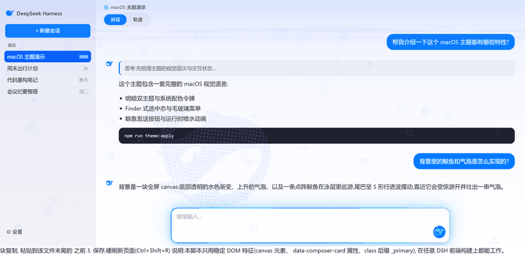
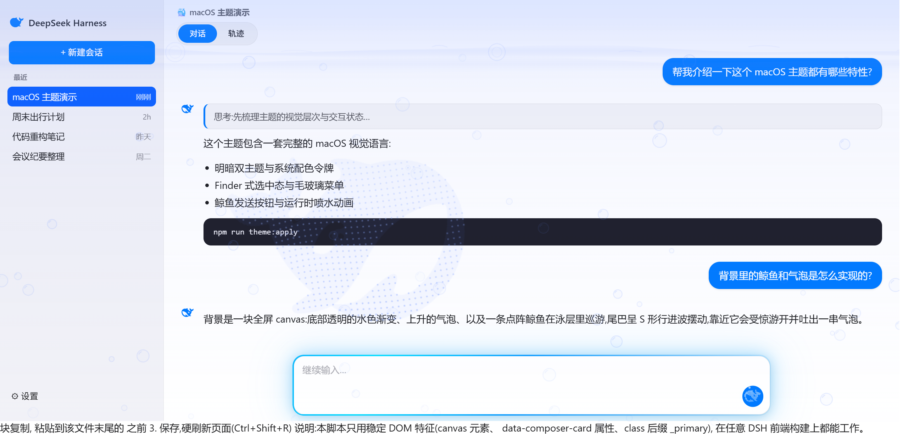
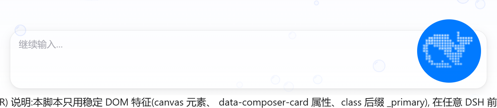
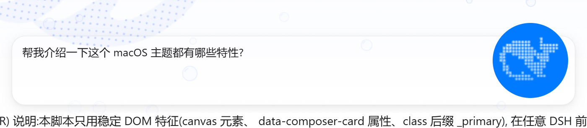
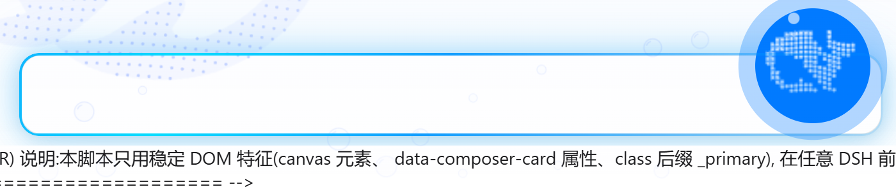
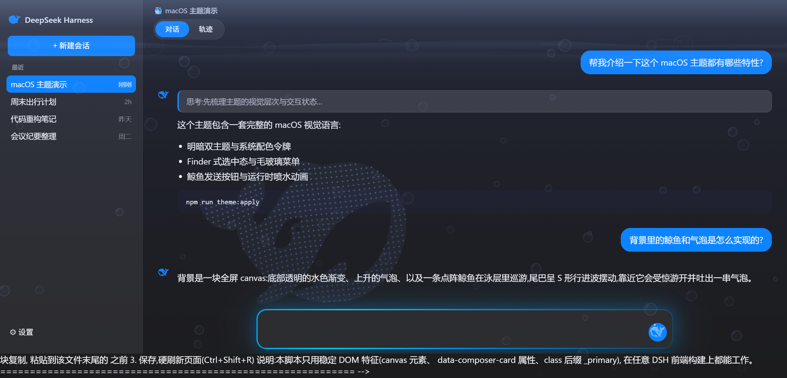
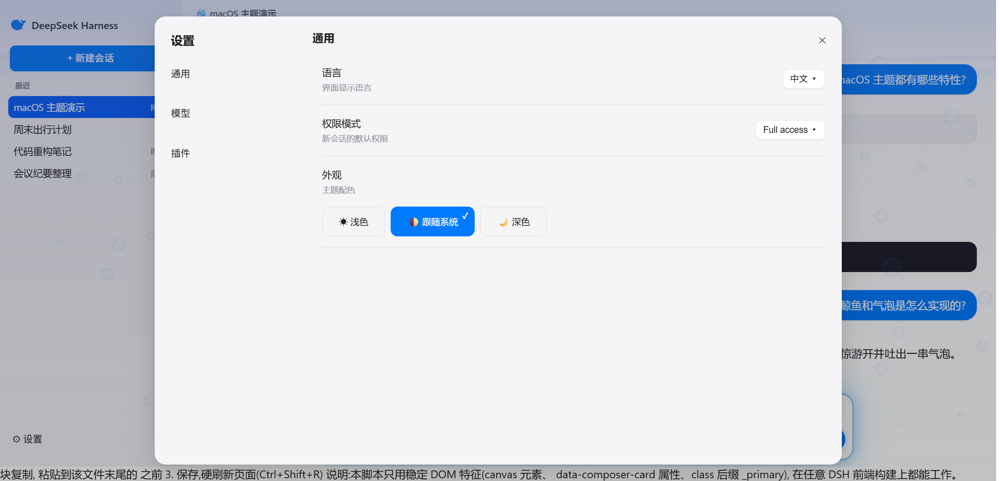
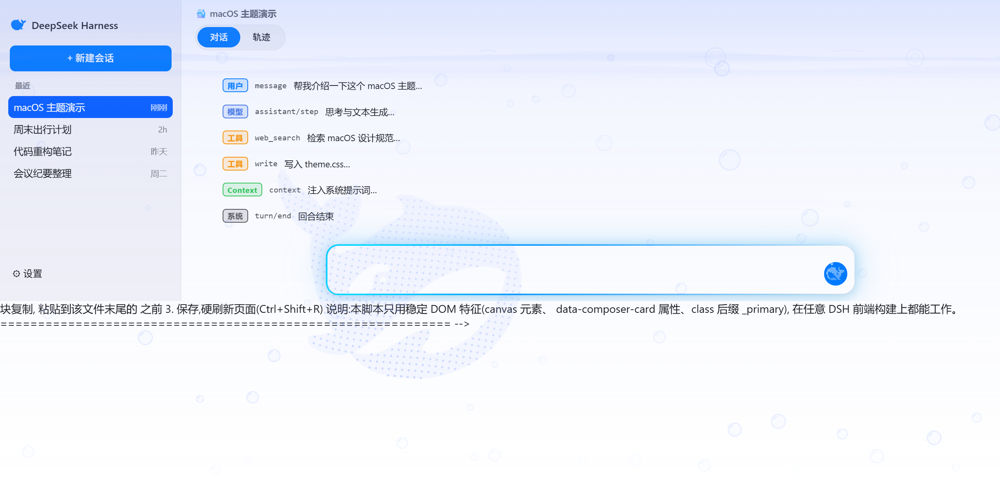

# 🐋 鲸蓝戏水 · DSH Whale Aqua Theme

给 [DeepSeek Harness](https://www.deepseek.com) Web GUI 用的 **macOS 风格主题 + 水中鲸鱼动态背景**。
适用于本地运行的 DeepSeek Harness Web 界面。

## 🖼️ 预览

> 截图与动图来自仓库内 `demo/preview.html`(纯演示页,使用真实主题 CSS 与背景脚本,内容为虚构示例)。

### 🎬 动态效果(鲸鱼游动 + 气泡 + 喷水 + 水母发光)



### 浅色模式(运行中)



### 鲸鱼发送按钮(三种状态)

未发送(空闲,静态鲸鱼):



输入文字时(鲸鱼保持静态,仅输入框有内容):



发送之后(运行中:摆尾游动 + 喷水泡 + 蓝色呼吸光环 + 水母发光):



### 深色模式



### 设置面板



### 轨迹视图



## ✨ 效果一览

- **水中鲸鱼背景**:极淡水色渐变(底部透明)+ 上升气泡(水面爆开)+ 点阵鲸鱼巡游(S 形行进波、尾部大摆、受惊吐泡)
- **鲸鱼发送按钮**:官方鲸鱼剪影,空闲静态;运行时头顶喷水泡 + 蓝色呼吸光环(选择器已做跨版本兼容)
- **苹果风皮肤**:macOS 配色(明/暗双主题)、克制圆角、毛玻璃菜单、Finder 式选中、水母发光输入框、磨砂对话区、设置面板统一化、轨迹彩色方框徽章
- 低开销:DPR 1.25、24fps、失焦/隐藏自动暂停、按钮动画按需绘制

## ⚠️ 版本兼容性(必读)

本主题分两部分,兼容性不同:

| 部分 | 跨 DSH 版本兼容性 |
| --- | --- |
| **背景动画 + 发送按钮鲸鱼**(index.html 脚本、whale-icon.css) | ✅ **任意版本可用**——只依赖稳定 DOM 特征(`data-composer-card` 属性、`_primary` 类后缀、canvas) |
| **皮肤样式 apple-style.css**(侧边栏/设置/轨迹等) | ⚠️ **依赖编译类名**——不同 DSH 版本的 CSS 类名哈希不同,可能部分或全部不生效 |

如果某部分皮肤没生效:在该页面按 F12 → 用选择器检查目标元素的实际类名(形如 `xYz123_row`),把 `apple-style.css` 中对应的哈希前缀替换成你版本里的前缀即可(类名后缀如 `_row` 是稳定的)。

## 🤖 一键 AI 部署(最推荐)

把下面代码块**原样复制**给你的 AI(DeepSeek Harness / Claude Code / ChatGPT 均可),让它自动完成定位、备份、复制和拼接,任何 DSH 版本都可执行:

````markdown
# 任务:给本机的 DeepSeek Harness Web GUI 安装「macOS 主题 + 水中鲸鱼背景」

请按以下步骤完成部署。只改 DSH 的 Web 静态文件,不修改源码、不重启服务、不破坏原有文件(先备份)。

## 第 1 步:定位 Web 前端目录
找到 DeepSeek Harness 的 Web 静态资源目录(特征:包含 index.html,路径形如
`.../node_modules/@deepseek-ai/dsh-web-frontend/dist/`),记为 `<DIST>`。
查找顺序:
1. 询问用户 DSH 的部署位置,在其下找 `dist/index.html`;
2. 全局搜索名为 `dsh-web-frontend` 的目录
   (Windows:`where /r C:\ dsh-web-frontend` 或按用户指定盘符;macOS/Linux:`find / -type d -name "dsh-web-frontend" 2>/dev/null`);
3. 若仍找不到,请停下来询问用户路径,不要瞎猜。

## 第 2 步:获取主题文件
执行 `git clone https://github.com/dataizu/dsh-whale-aqua-theme` 到临时目录(记为 `<THEME>`)。
若网络受限,让用户手动下载该仓库的 zip 并解压,继续后面的步骤。

## 第 3 步:备份原文件
```
cp <DIST>/index.html <DIST>/index.html.bak
cp <DIST>/apple-style.css <DIST>/apple-style.css.bak 2>/dev/null || true
cp <DIST>/whale-icon.css <DIST>/whale-icon.css.bak 2>/dev/null || true
```

## 第 4 步:复制样式文件
```
cp <THEME>/apple-style.css  <DIST>/apple-style.css
cp <THEME>/whale-icon.css   <DIST>/whale-icon.css
```

## 第 5 步:把背景动画脚本拼进 index.html(幂等,可重复执行)
读取 `<DIST>/index.html` 后:
1. 若其中已包含 `whale-icon.css` 字样 → 跳过链接插入;否则在 `</head>` 之前插入两行:
   ```
   <link rel="stylesheet" href="/whale-icon.css" />
   <link rel="stylesheet" href="/apple-style.css" />
   ```
2. 若其中已包含 `dsh-bg-canvas` 字样 → 跳过脚本插入;否则把
   `<THEME>/install/background-snippet.html` 中 HTML 注释以下的**整个** `<script>...</script>` 块,
   插入到 `</body>` 之前。
3. 保存文件。

## 第 6 步:校验
1. 确认 `<DIST>` 下三个文件存在且非空;
2. 提取 index.html 中 `<script>` 的内容存为临时 .js,若本机有 node 则执行 `node --check` 校验语法;
3. 检查 index.html 里引用的 `/assets/*.js`、`/assets/*.css` 文件名,与 `<DIST>/assets/` 目录下的实际文件是否一致:
   - 一致 → 全部功能可用;
   - 不一致 → 说明本机 DSH 版本与主题开发版不同:**背景动画和鲸鱼发送按钮仍可用**,但皮肤
     `apple-style.css`(侧边栏/设置面板/轨迹样式)可能部分不生效。此时读取本机
     `dsh-web-frontend` 包目录下 package.json 的 `version` 字段,把版本号报告给用户,
     并说明"把该版本号反馈给主题作者即可生成适配版皮肤"。

## 第 7 步:验证与报告
1. 提醒用户硬刷新页面(Ctrl+Shift+R)查看效果;
2. 报告以下信息:定位到的 `<DIST>` 路径、执行了哪些修改、备份文件位置、DSH 前端版本号、是否有"皮肤可能不生效"的提示。
````

> 该提示词也保存在仓库根目录的 `AI_DEPLOY_PROMPT.md`,方便单独复制。

## 🚀 手动安装方法

### 方法 A:补丁式安装(推荐,任意 DSH 版本)

1. 找到 DSH 的 Web 前端目录,通常形如:
   ```
   <你的 DSH 部署目录>/node_modules/@deepseek-ai/dsh-web-frontend/dist/
   ```
2. 复制 `apple-style.css`、`whale-icon.css` 到该 `dist` 目录。
3. 打开该目录下的 `index.html`(目标机器自己的,不要用本仓库的覆盖!),做两处修改:
   - 在 `<head>` 里加两行:
     ```html
     <link rel="stylesheet" href="/whale-icon.css" />
     <link rel="stylesheet" href="/apple-style.css" />
     ```
   - 把 `install/background-snippet.html` 里的整个 `<script>...</script>` 块复制到 `</body>` 之前。
4. 硬刷新(`Ctrl+Shift+R`)。

### 方法 B:整页覆盖(仅限与开发版本相同的 DSH 构建)

把 `same-version/index.html` 与两个 CSS 一起覆盖到 `dist`。
> 不同版本的 DSH 前端资源文件名不同,直接覆盖会导致界面无法加载——所以默认请不要用这个方法。

## 📁 文件清单

| 文件 | 作用 |
| --- | --- |
| `apple-style.css` | macOS 皮肤全套(配色、分区样式、水母发光、磨砂对话区) |
| `whale-icon.css` | 发送按钮鲸鱼图标与喷水动画(跨版本) |
| `install/background-snippet.html` | 背景动画脚本补丁(跨版本,拼进自己的 index.html) |
| `same-version/index.html` | 完整页面(仅同版本构建可用) |
| `whale-path.txt` | DeepSeek 官方鲸鱼 SVG path 的压缩版(3 位小数,点阵采样数据源) |
| `template.html` | index.html 模板(鲸鱼 path 用 `__WHALE_PATH__` 占位) |
| `reference/hero-whale.svg` | 官方 hero 鲸鱼 SVG 参考 |

## 🎚️ 常见调参点

| 想调什么 | 在哪里 |
| --- | --- |
| 发送按钮喷水位置/大小 | `whale-icon.css` 中 `::before` / `::after`(两粒水泡)的 `left/top/width/height` |
| 输入框发光强弱/流速 | `apple-style.css` 中 `dsh-jelly-breathe` / `dsh-jelly-flow` 关键帧 |
| 对话区毛玻璃透明度/模糊 | `apple-style.css` 中 `body .Md3f7G_scroll` |
| 背景气泡数量/大小/速度 | `install/background-snippet.html` 脚本中 `BUB_CAP`、`newBubble` |
| 鲸鱼游速/摆幅/受惊 | 同脚本中 `updateWhale` 与 `whaleWave` 相关参数 |
| 性能档位(DPR/帧率) | 同脚本中 `DPR = Math.min(..., 1.25)` 与 `ts - lastT < 41` |

## 📄 许可与声明

- 样式与脚本代码:**MIT License**(见 `LICENSE`)。
- **DeepSeek 鲸鱼图形为 DeepSeek 官方资产**,版权归 DeepSeek 所有;本仓库仅用于个人主题美化,请勿商用。

---

English / 简体中文双语说明,欢迎 PR 与 Issue。
